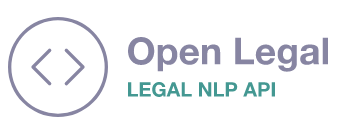

Web API for extracting content from unstructured legal text.

This API predominantly exposes features available in [LexNLP](https://lexpredict-lexnlp.readthedocs.io/en/latest/modules/extract/extract.html) though with plans to add in ML & other custom created extractions in the near future.

## Running precompiled image
You can also pull and run this docker image from Docker Hub:

`docker pull openlegal/legalnlp-api`

followed by

`docker run -p 80:80 openlegal/legal-nlp-api`

## Documentation

A Postman file is available in this repo /Legal-NLP-API.postman_collection.json

Documentation is available on /docs when you run the docker image.

## Demo 

The latest version is available here: https://legal-nlp-api.lemonsmoke-5a527c27.westeurope.azurecontainerapps.io/docs

*Important note - this isn't your own version, do not send production content to this endpoint*
